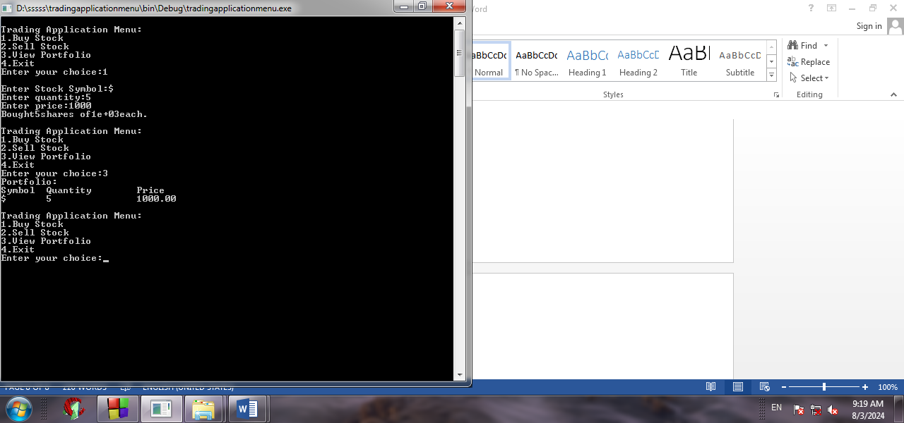
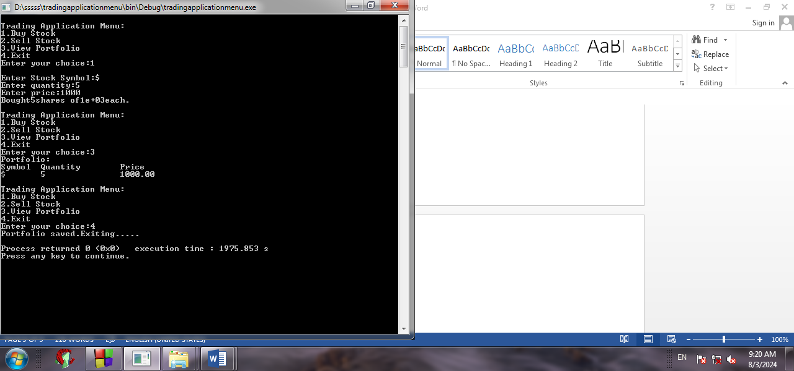

# Trading Application Menu (C++)

A menu-driven console application written in C++ to manage a simple stock portfolio. The portfolio is saved to a text file when you exit, so it is loaded again the next time you run the program.

Built as a project at Disha Computer Institute, Solapur.

## Features

- Buy stocks by symbol, quantity and price (buying more of the same stock adds to its quantity)
- Sell stocks, with a check that you have enough shares
- View the full portfolio (symbol, quantity, price)
- Portfolio saved to `portfolio.txt` on exit and loaded on start

## Concepts Used

- `struct` for stock data
- `unordered_map` (STL) for fast lookup by stock symbol
- File handling with `ifstream` and `ofstream`
- Functions and menu-driven programming with `switch` and `do-while`

## How to Run

```bash
g++ main.cpp -o trading
./trading
```

On Windows, run `trading.exe` instead of `./trading`.

## Menu

```
Trading Application Menu:
1. Buy Stock
2. Sell Stock
3. View Portfolio
4. Exit
```

## Screenshots




## Limitations

- Stock symbols must be a single word (no spaces)
- Prices are entered manually; there is no live market data
- The portfolio is saved only when you choose Exit

## Author

Zona Sameer Rangrez

